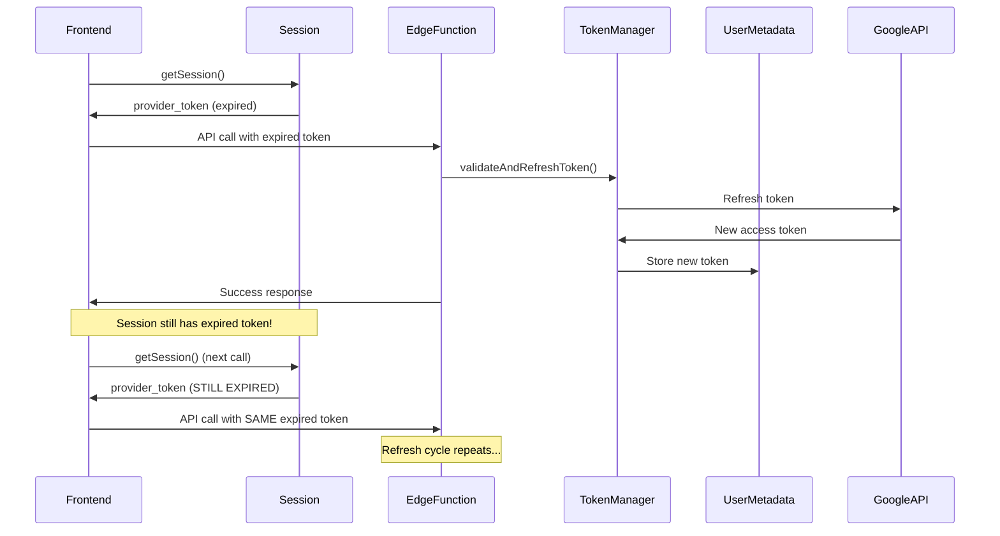

# OAuth Token Management Deep Dive Analysis

## 🔍 Executive Summary

After a comprehensive audit of the OAuth token management system, I've identified **critical issues** that prevent proper token refresh and cause authentication failures. While the infrastructure for centralized token management exists, there are significant inconsistencies in implementation and a fundamental disconnect between backend token storage and frontend token usage.

## ❌ Critical Issues Identified

### 1. **Inconsistent Token Management Across Edge Functions**

**Problem:** Not all Edge Functions use the centralized OAuth Token Manager.

| Edge Function | Uses Token Manager? | Status |
|--------------|-------------------|--------|
| `create-google-meet` | ❌ NO | Uses manual token refresh logic |
| `update-google-meet` | ✅ YES | Uses `getValidatedGoogleToken()` |
| `cancel-google-meet` | ✅ YES | Uses `getValidatedGoogleToken()` |
| `get-token-status` | ⚠️ PARTIAL | Uses manager for validation only |
| `refresh-google-token` | ⚠️ PARTIAL | Uses manager for refresh only |

**Impact:** Inconsistent behavior across the application. Some operations fail with expired tokens while others work correctly.

### 2. **Session vs. Metadata Token Mismatch** 🚨 CRITICAL

**Problem:** Fundamental disconnect between where tokens are stored and where they're retrieved from.

```typescript
// Backend (Edge Functions) - Stores in METADATA
await TokenStorage.storeTokens(supabase, userId, accessToken, refreshToken, ...);
// Stores in: user_metadata.google_access_token

// Frontend - Reads from SESSION
const { data: { session } } = await supabase.auth.getSession();
const token = session.provider_token;  // Reads from: session.provider_token
```

**The Disconnect:**
- Backend refreshes tokens and stores them in `user_metadata`
- Frontend reads tokens from `session.provider_token` 
- These two storage locations are **completely separate**
- Result: Frontend continues using expired tokens even after backend refreshes them

### 3. **No Session Update After Token Refresh** 🚨 CRITICAL

**Problem:** When tokens are refreshed in Edge Functions, the user's session is NOT updated.

**Current Flow:**
```
1. User makes API call → Edge Function receives expired token
2. Edge Function refreshes token → Stores in user_metadata
3. Edge Function completes successfully
4. Frontend still has old session with expired token
5. Next API call fails with same expired token
```

**What's Missing:**
- No mechanism to update `session.provider_token` after refresh
- No way for frontend to know tokens were refreshed
- No synchronization between metadata storage and session storage

### 4. **Frontend Google Calendar Service Has No Token Refresh**

**Problem:** Frontend service directly uses session tokens without any refresh logic.

```typescript:src/integrations/google/calendar.ts
private async getAccessToken(): Promise<string> {
  const { data: { session } } = await supabase.auth.getSession();
  
  if (!session) {
    throw new Error('No active session. Please sign in.');
  }

  if (session.provider_token) {
    return session.provider_token;  // May be expired!
  }
  // ... no refresh logic here
}
```

**Issues:**
- No check for token expiry
- No automatic token refresh
- No retry mechanism for 401 errors
- Caches session without checking token validity

### 5. **Token Storage Strategy Confusion**

**Problem:** Multiple storage strategies without clear documentation on which to use.

**Three Different Approaches:**
1. **Session Storage** (`session.provider_token`) - Used by frontend
2. **User Metadata** (`user_metadata.google_access_token`) - Used by backend
3. **Database Table** (`oauth_tokens` table) - Implemented but not used

**Result:** No single source of truth for token state.

### 6. **Missing Token Synchronization**

**Problem:** No mechanism to propagate refreshed tokens from backend to frontend.

**What's Needed:**
- After backend refreshes token, frontend needs to update its session
- Options:
  - Force session refresh from frontend
  - Return new token in API response
  - Use websocket/realtime for token updates
  - Store in shared location that both can access

## 🔄 Current Token Flow (Broken)



## 🎯 Root Causes

1. **Architectural Mismatch:** Supabase sessions store OAuth provider tokens separately from user metadata
2. **No Session Update API:** No built-in way to update `provider_token` in an active session
3. **Incomplete Implementation:** Token manager was built but not fully integrated
4. **Storage Confusion:** Mixed use of session storage vs. metadata storage

## 📋 Detailed Issues by Component

### Edge Functions

#### `create-google-meet/index.ts`
```typescript
// ❌ ISSUE: Manual token refresh logic instead of using shared manager
const refreshAccessToken = async (refreshToken: string): Promise<string> => {
  // ... duplicated refresh logic
};

const makeCalendarRequest = async (token: string, attempt = 1) => {
  // ... manual retry logic
};
```

**Problems:**
- Duplicates code from `OAuthTokenManager`
- Doesn't store refreshed tokens in metadata
- Inconsistent with other Edge Functions
- No analytics logging for refreshes

#### `get-token-status/index.ts` & `refresh-google-token/index.ts`
```typescript
// ⚠️ ISSUE: Stores in metadata but session not updated
const storeResult = await TokenStorage.storeTokens(
  supabase, userId, newAccessToken, refreshToken, expiresIn, scope
);
// Session still has old token!
```

**Problems:**
- Stores tokens in `user_metadata` 
- Frontend reads from `session.provider_token`
- No synchronization between the two

### Frontend Components

#### `src/integrations/google/calendar.ts`
```typescript
// ❌ ISSUE: No token expiry checking or refresh logic
private async getAccessToken(): Promise<string> {
  const { data: { session } } = await supabase.auth.getSession();
  
  if (session.provider_token) {
    return session.provider_token;  // Blindly returns, even if expired
  }
  
  throw new Error('Google Calendar access not available...');
}
```

**Problems:**
- No token validation before use
- No automatic refresh on 401 errors
- No coordination with backend token refresh
- Session cache may contain expired tokens

#### `src/components/TokenManagementDashboard.tsx`
```typescript
// ⚠️ ISSUE: Can refresh token but user experience is poor
const refreshToken = async () => {
  // Calls edge function to refresh
  const response = await fetch(`${SUPABASE_URL}/functions/v1/refresh-google-token`, ...);
  
  await fetchTokenStatus();
  onTokenRefresh?.();  // Manual callback required
};
```

**Problems:**
- Requires manual user action
- Doesn't automatically update session after refresh
- Callbacks must manually refetch data
- No automatic retry for failed operations

### Token Storage Layer

#### `token-storage.ts`
```typescript
// ⚠️ ISSUE: Only updates user_metadata, not session
static async storeTokens(
  supabase: SupabaseClient,
  userId: string,
  accessToken: string,
  ...
) {
  await supabase.auth.admin.updateUserById(userId, {
    user_metadata: metadata,  // Only updates metadata
  });
  // Session.provider_token remains unchanged!
}
```

**Problems:**
- No way to update active session's `provider_token`
- Frontend and backend are out of sync
- Two separate sources of truth

## 🔧 Required Fixes

### Priority 1: Critical Fixes (Must Have)

1. **Update `create-google-meet` to use `OAuthTokenManager`**
   - Remove duplicated token refresh logic
   - Use `getValidatedGoogleToken()` helper
   - Ensure consistent behavior across all Edge Functions

2. **Implement Session Token Update Mechanism**
   - Option A: Force frontend to refresh session after backend operations
   - Option B: Return new tokens in API responses (security risk)
   - Option C: Use metadata as primary storage, update frontend to read from there

3. **Add Token Refresh to Frontend Calendar Service**
   - Check token expiry before making requests
   - Implement automatic refresh on 401 errors
   - Add retry logic with exponential backoff

4. **Standardize Token Storage Strategy**
   - Choose ONE source of truth (recommend: user metadata)
   - Update all code to use consistent storage/retrieval
   - Document the strategy clearly

### Priority 2: Important Fixes

5. **Add Proactive Token Refresh**
   - Refresh tokens before they expire (5-10 min buffer)
   - Background refresh in frontend when token is close to expiry
   - Reduce failed requests due to expired tokens

6. **Improve Error Handling**
   - Better error messages for token issues
   - Distinguish between "token expired" and "refresh failed"
   - Graceful degradation when refresh fails

7. **Add Token Synchronization Events**
   - Use Supabase Realtime to broadcast token updates
   - Or implement a polling mechanism to check for new tokens
   - Ensure all tabs/windows stay in sync

### Priority 3: Nice to Have

8. **Implement Token Caching Strategy**
   - Cache validated tokens for short periods
   - Reduce redundant validation calls
   - Implement proper cache invalidation

9. **Add Comprehensive Analytics**
   - Track token refresh frequency
   - Monitor refresh success/failure rates
   - Alert on abnormal token refresh patterns

10. **Create Developer Tools**
    - Token status debugging dashboard
    - Force refresh button for testing
    - Token expiry countdown timer

## 🎯 Recommended Solution Architecture

### Option A: Frontend Session Refresh (Recommended)

**Approach:** After backend refreshes token, force frontend to refresh its session.

```typescript
// Backend: After token refresh, set a flag in metadata
await TokenStorage.storeTokens(supabase, userId, newToken, ...);
await supabase.auth.admin.updateUserById(userId, {
  user_metadata: {
    ...existing,
    token_refreshed_at: new Date().toISOString(),
  }
});

// Frontend: Check for refresh flag and update session
const { data: { user } } = await supabase.auth.getUser();
if (user.user_metadata.token_refreshed_at) {
  // Force session refresh from Supabase
  await supabase.auth.refreshSession();
  // Clear the flag
  // ...
}
```

**Pros:**
- Works with existing Supabase architecture
- Maintains security (tokens in session)
- No API changes needed

**Cons:**
- Requires polling or event listening
- Additional API calls
- Slight delay in token availability

### Option B: Metadata as Primary Storage

**Approach:** Store tokens in metadata, read from metadata everywhere.

```typescript
// Both backend AND frontend read from metadata
const { data: { user } } = await supabase.auth.getUser();
const accessToken = user.user_metadata.google_access_token;
```

**Pros:**
- Single source of truth
- Simpler synchronization
- Works across all Edge Functions

**Cons:**
- Requires updating all frontend code
- Extra database call for every token access
- Metadata size limits (may be an issue)

### Option C: Hybrid Approach with Return Values

**Approach:** Edge Functions return new tokens in response, frontend updates cache.

```typescript
// Backend: Return new token if refreshed
return {
  success: true,
  data: result,
  tokenRefreshed: wasRefreshed,
  newAccessToken: wasRefreshed ? newToken : undefined,
};

// Frontend: Update session cache if token returned
if (response.tokenRefreshed && response.newAccessToken) {
  sessionCache.provider_token = response.newAccessToken;
}
```

**Pros:**
- Immediate synchronization
- No extra API calls
- Frontend always has latest token

**Cons:**
- Security concern (tokens in responses)
- Requires updating all Edge Function responses
- More complex frontend logic

## 📊 Impact Assessment

| Issue | Severity | Impact | Effort |
|-------|----------|--------|--------|
| Session/Metadata mismatch | 🔴 Critical | Users repeatedly fail auth | High |
| No session update after refresh | 🔴 Critical | Token refresh doesn't help | High |
| Inconsistent Edge Functions | 🟡 High | Some operations fail | Medium |
| No frontend token refresh | 🟡 High | Poor UX with expired tokens | Medium |
| Token storage confusion | 🟢 Medium | Developer confusion | Low |

## ✅ Success Criteria

After fixes are implemented, the system should:

1. ✅ **Automatically refresh expired tokens** without user intervention
2. ✅ **Synchronize tokens** between backend and frontend immediately
3. ✅ **Use consistent token management** across all Edge Functions
4. ✅ **Provide clear feedback** when token refresh fails
5. ✅ **Support multiple tabs/windows** with synchronized tokens
6. ✅ **Track and monitor** token refresh events for debugging
7. ✅ **Gracefully handle** Google API quota limits and errors

## 🚀 Next Steps

1. Review this analysis with team
2. Choose token synchronization approach (A, B, or C)
3. Create implementation plan with milestones
4. Implement fixes in priority order
5. Test thoroughly with various scenarios:
   - Expired token at API call time
   - Multiple concurrent API calls
   - Multiple browser tabs
   - Token refresh failures
   - Google Cloud Project issues
6. Update documentation
7. Deploy and monitor

## 📚 Related Documentation

- `/workspace/docs/OAUTH_TOKEN_MANAGEMENT_SOLUTION.md` - Original design
- `/workspace/docs/GOOGLE_OAUTH_SETUP.md` - OAuth setup guide
- `/workspace/docs/URGENT_GOOGLE_SETUP_FIX.md` - Google Cloud project fix
- `/workspace/supabase/functions/_shared/oauth-token-manager.ts` - Token manager implementation
- `/workspace/supabase/functions/_shared/token-storage.ts` - Token storage implementation

---

**Document Created:** 2025-10-23  
**Analysis Depth:** Complete system audit  
**Recommended Action:** Immediate implementation of Priority 1 fixes
